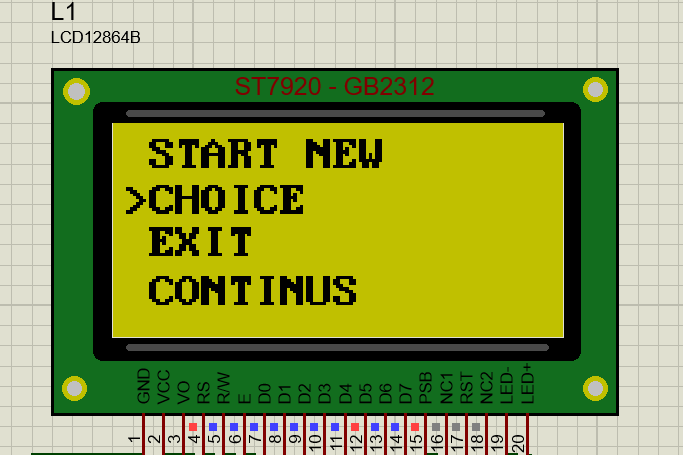
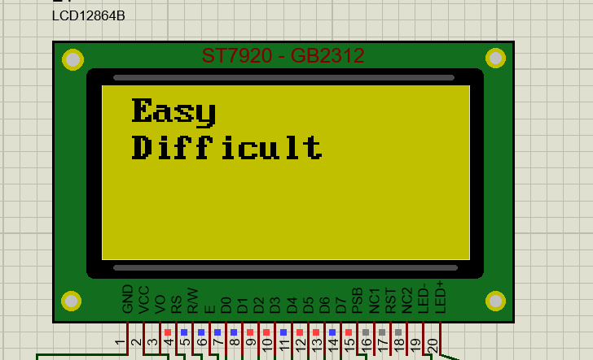
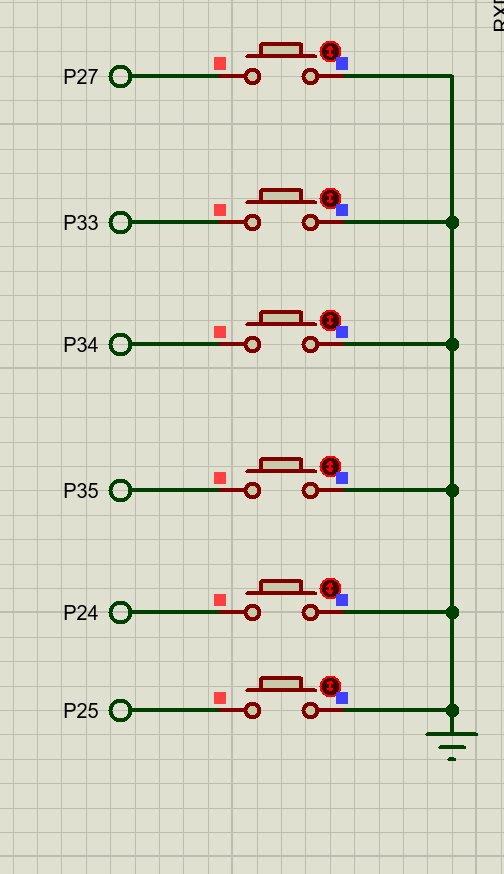
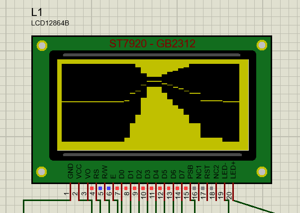
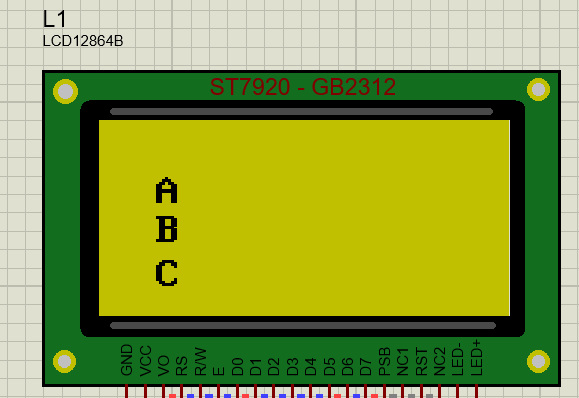
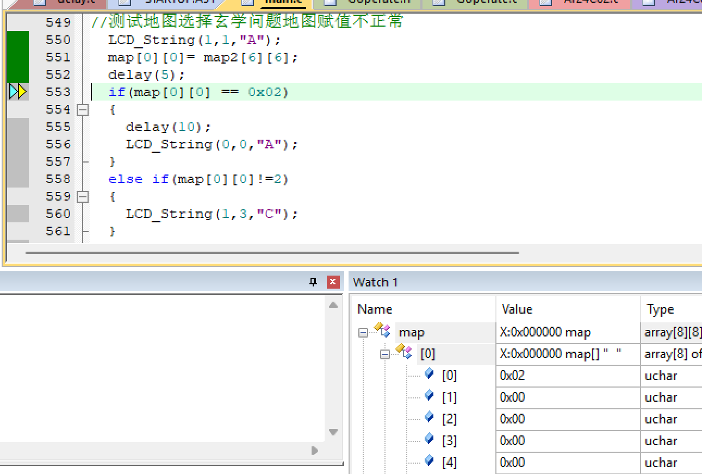
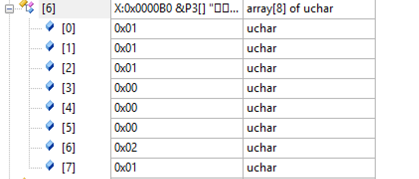

# 3秒一帧"高刷"游戏功能介绍

## 菜单栏


- START NEW开始选项，重新开始
- CHOICE 难度模式选项
 

- EXIT 退出选项
- CONTINUS 继续上次残局选项
  
## 按键介绍

- 在菜单界面中
  P27是切换选择
  P33是确定选择
- 在难度选择地图选择模式中
  P24是切换选择
  P25是确定选择
- 在游戏模式中
  P34是前进
  P35是后退
  P24是转向
  P25是退出并保存残局
  

  ### 存在问题？？
  地图切换问题？？
  经过一些小测试，我发现地图赋值不正常的问题导致地图切换并不能顺利进展，问题如下（这是测试代码的显示现象）：
  
这是我的测试代码
  ```c
	LCD_Init();
    ////²âÊÔ
    //	LCD_Enter_Text_Mode();
    //	
    //	LCD_String(1,1,"H");
    //	delay(1000);
    //	LCD_Text_Mode_Clear();
    //	LCD_Enter_GDRAM_Mode();
    //	testrender();
    //	
    //²âÊÔµØͼѡÔñÐþѧÎÊÌâµØͼ¸³Öµ²»Õý³£
	LCD_String(1,1,"A");
	map[0][0]= map2[6][6];
	delay(5);
	if(map[0][0] == 0x02)
	{
		delay(10);
		LCD_String(0,0,"A");
	}
	else if(map[0][0]!=2)
	{
		LCD_String(1,3,"C");
	}
	LCD_String(1,2,"B");

  ```
  - 调试记录
  - 
  经单步调试左侧显示变量map[0][0]已经被赋值为0x02，但是经过仿真运行else if的条件成立，if里的条件却不成立，难道是编译器编译的错误吗
  下面看对应的返回编
  ```nasm
        551:         map[0][0]= map2[6][6]; 
        C:0x0AB6    9000B6   MOV      DPTR,#0x00B6
        C:0x0AB9    E0       MOVX     A,@DPTR
        C:0x0ABA    900000   MOV      DPTR,#C_STARTUP(0x0000)
        C:0x0ABD    F0       MOVX     @DPTR,A
        552:         delay(5); 
        C:0x0ABE    7F05     MOV      R7,#0x05
        C:0x0AC0    7E00     MOV      R6,#map(0x00)
        C:0x0AC2    120DC4   LCALL    delay(C:0DC4)
        553:         if(map[0][0] == 0x02) 
        C:0x0AC5    900000   MOV      DPTR,#C_STARTUP(0x0000)
  ```
  - 0x00B6是map[6][6]变量的地址
  
  我们可以看到这里确实为0x02
  0x0000则是对应map[0][0]的地址，返回编显示是对其进行了赋值
  - 综上反汇编里显示的赋值时并没有问题的，但是为什么else if条件成立，这里本人还没有能力解决这个问题，求大佬帮助
  
  ### 未经验证？？？
  ##### 还有一个未经验证的问题，本人并没有走通过这个迷宫，因为仿真里2~3秒一帧真的太难受了，只对基本的前进后退转向以及菜单操作和一些功能按键的验证，虽然有结算界面的逻辑以及出口显示的逻辑，但是未经验证,好了这个先介绍到这里